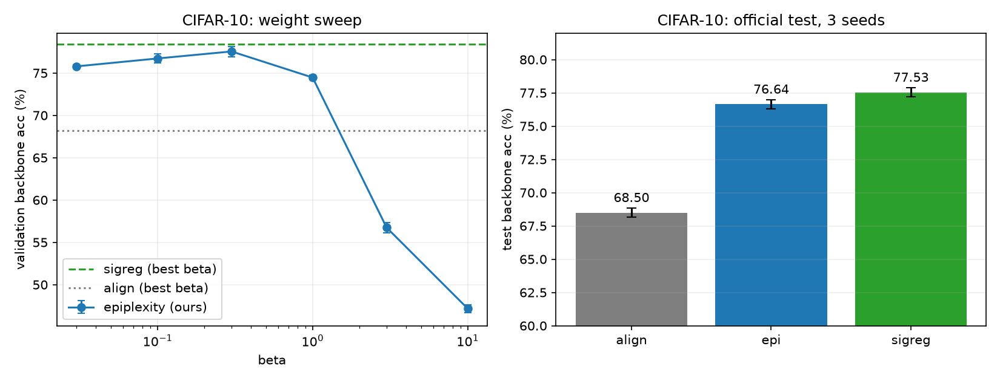
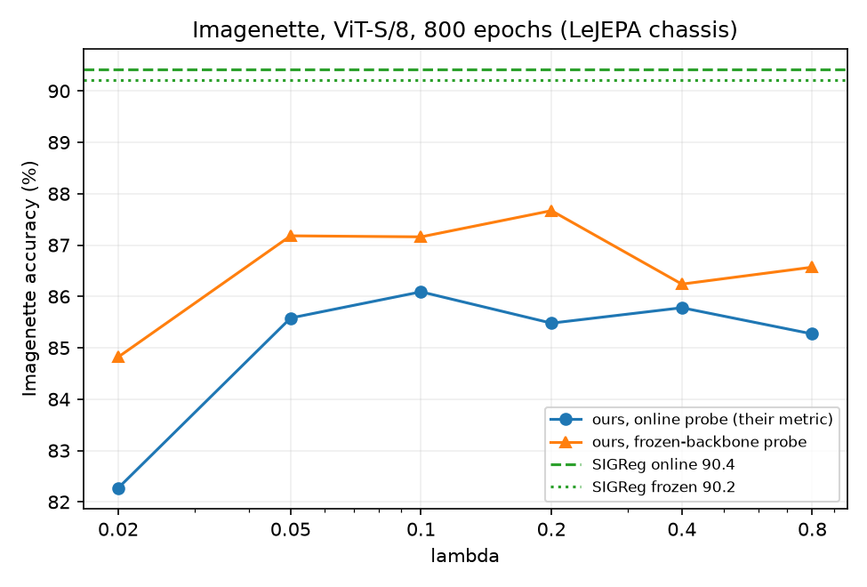

# EpiJEPA

EpiJEPA tests an epiplexity-inspired alternative to SIGReg for preventing collapse in joint-embedding models. It rewards embeddings that a linear readout can recover from a frozen random CNN, while training different views of each image to agree.

On CIFAR-10, the method reaches **76.64%** backbone probe accuracy, compared with **77.53%** for SIGReg. On Imagenette, the frozen-backbone scores are **87.16%** and **90.22%**. These experiments show that the proposed score can provide a useful anti-collapse signal. SIGReg leads on accuracy in both settings.

## The idea

View agreement has a trivial solution: give every image the same embedding. An anti-collapse regulariser gives the encoder a reason to preserve differences between images.

[LeJEPA's SIGReg](https://arxiv.org/abs/2511.08544) projects embeddings onto random directions and compares each one-dimensional distribution with a standard Gaussian. Its characteristic-function test uses averages of sine and cosine functions. Minimising the discrepancy encourages an isotropic Gaussian embedding distribution.

[Epiplexity](https://arxiv.org/abs/2601.03220) describes the structural information a computationally limited observer can learn. Formally, it is the description length of a model selected to minimise the combined description length of model and data under a compute budget. This separates learnable structure from residual uncertainty.

The approximation used here comes from **Yanbo Zhang and Michael Levin, [Intelligence from Learnable Novelty](https://arxiv.org/html/2607.18433v1#S3)** (2026, Section 3, Equations 6–9). Their estimator fits a ridge readout of frozen random reservoir features and scores its spectral description length with a log-determinant. EpiJEPA applies this estimator as an anti-collapse regulariser alongside view agreement. The ridge solve approximates the description-length minimisation; our implementation uses the equivalent `WᵀW` determinant form of their Equation 9.

## How it works

For each augmented view, the encoder produces embeddings `Z` and a frozen, randomly initialised CNN produces features `H`. We centre each feature column, divide by its batch standard deviation, and scale by the inverse square root of the feature width. We then fit a ridge readout to the centred embeddings `Zc`:

```text
W = (HᵀH + ρI)⁻¹ HᵀZc
S = ½ log₂ det(I + ηWᵀW)
```

The defaults are `ρ = 3`, `η = 30`, and 64 reservoir features. The readout is solved on each batch using QR decomposition. Gradients flow through the score into the encoder; the reservoir stays fixed. The implementation is in [epiplexity.py](epiplexity.py).

Constant embeddings have `Zc = 0` and score zero. At a fixed sum of squared singular values of `W`, spreading that magnitude across more directions increases the score. The score also increases with readout scale: it is a reward for readout magnitude and diversity, not a measure of held-out prediction accuracy. Embedding normalisation therefore matters.

Training combines view agreement with the negative score, averaged over views:

```text
CIFAR-10:   loss = alignment / A₀ − β · S / S₀
Imagenette: loss = (1 − λ) · invariance − λ · S / S₀
```

Initial losses on four batches set the fixed scales `A₀` and `S₀`. CIFAR also normalises SIGReg by its initial value. The reservoir uses channel normalisation, ELU activations and 2×2 pooling, with four convolutional stages for CIFAR and six for Imagenette.

## Results

### CIFAR-10

ResNet-18, 64-dimensional embeddings, 100 epochs, three seeds. We select each method's weight by mean backbone validation accuracy, then evaluate the selected runs on the official test split. Probe accuracies are percentages; ± is the sample standard deviation across seeds.

| Regulariser | β | Backbone probe | Embedding probe | Embedding effective rank |
|---|---:|---:|---:|---:|
| None | 0 | 68.50 ± 0.35 | 48.03 | 1.0 |
| EpiJEPA | 0.3 | 76.64 ± 0.36 | 71.78 | 58.4 |
| SIGReg | 10 | 77.53 ± 0.34 | 73.17 | 24.7 |

EpiJEPA improves backbone accuracy by 8.15 percentage points over alignment alone and trails SIGReg by 0.89. Its higher embedding rank does not translate into higher accuracy. The control retains information in the backbone despite its nearly rank-one embedding.

**The CIFAR comparison also changes output normalisation.** EpiJEPA and the control use non-affine BatchNorm after the embedding head. SIGReg receives raw outputs because its target already specifies a scale. This experiment compares those complete recipes.

The EpiJEPA weight sweep peaks at β = 0.3. Mean validation backbone accuracy falls from 77.55% at that weight to 47.17% at β = 10. A large score alone is insufficient for a useful representation.



### Imagenette

ViT-S/8 at 128-pixel resolution, four views, 16-dimensional projector output, one seed. The training script adapts LeJEPA's [minimal example](https://github.com/galilai-group/lejepa/blob/c293d291ca87cd4fddee9d3fffe4e914c7272052/MINIMAL.md) to local image folders and adds a regulariser switch, calibration and checkpointing. The methods share the encoder, projector, augmentations, optimiser and schedule.

| Regulariser | λ | Final online probe | Best online epoch | Frozen-backbone probe | Backbone effective rank |
|---|---:|---:|---:|---:|---:|
| None | 0 | 10.96 | 19.64 | 23.31 | 1.5 |
| EpiJEPA | 0.1 | 86.09 | 87.16 | 87.16 | 26.6 |
| SIGReg | 0.02 | 90.42 | 90.88 | 90.22 | 38.9 |

All accuracies use Imagenette's validation split. The regularised runs completed 800 epochs; the saved control run stopped after 231. Its final online accuracy is close to the 10% chance level.

The online classifier trains alongside the encoder on detached features, so its labels do not train the representation. The frozen-backbone probe fits a new logistic-regression classifier after pretraining. On that measure, EpiJEPA trails SIGReg by 3.06 points; the final online gap is 4.33 points.

For λ from 0.05 to 0.8, EpiJEPA's final online accuracy ranges from 85.27% to 86.09%. At λ = 0.02 it falls to 82.27%. These are single-seed observations on the same validation split used for the sweep, so they provide an exploratory comparison.



The tables and figures come from the JSON files in [results/](results/). The CIFAR rank describes the embedding; the Imagenette rank describes the backbone. Each is an entropy-based effective rank computed from the covariance spectrum.

### Ablation: epiplexity alone

Removing view agreement and maximising only the score gives the following validation results:

| Dataset | Backbone probe | Other measurements |
|---|---:|---|
| CIFAR-10, three seeds | 44.21 ± 0.63 | Embedding probe 33.67%; embedding effective rank 62.1 of 64 |
| Imagenette, one seed | 37.35 | Final online probe 32.20%; backbone effective rank 15.9 |

The score preserves variation, but classification is substantially weaker without view agreement. On CIFAR, the frozen reservoir's own features reach 32.7% probe accuracy. On Imagenette, the unnormalised projector outputs also grow in scale during training. These results support using epiplexity as an anti-collapse regulariser alongside alignment. The saved measurements are in [results/pure_epiplexity.json](results/pure_epiplexity.json).

### What the embeddings look like

EpiJEPA's CIFAR embeddings have heavier tails and lower average absolute coordinate correlation than SIGReg's: excess kurtosis is 4.15 versus 0.51, and correlation is 0.048 versus 0.136. On Imagenette, projector excess kurtosis is 3.41 for EpiJEPA and 0.14 for SIGReg. A Gaussian has zero excess kurtosis. These coordinate-level measurements support describing SIGReg's embeddings as more Gaussian, without establishing that their full joint distribution is Gaussian.

Figures, metrics, exported embeddings and analysis scripts are in [embedding_analysis/](embedding_analysis/).

## Run the experiments

Run these commands from the repository root:

```bash
pip install -r requirements.txt
# Required for the CIFAR SIGReg arm; Imagenette includes its own implementation.
pip install git+https://github.com/galilai-group/lejepa.git@c293d291ca87cd4fddee9d3fffe4e914c7272052

# Train the CIFAR weight sweep, select weights on validation, and evaluate on test.
python cifar/train.py --out runs/cifar --stage test
python cifar/analyze.py --runs runs/cifar
```

The default sweep runs all three methods on seeds 0, 1 and 2. The curated validation table includes a SIGReg β = 100 run; add `100` to `--weights` to include that weight in a new sweep.

For Imagenette, download [imagenette2-160](https://github.com/fastai/imagenette) and extract it to `data/imagenette2-160`, with class folders under `train/` and `val/`:

```bash
python imagenette/train.py --out runs/imagenette/sigreg --data data/imagenette2-160 --method sigreg --lamb 0.02
python imagenette/train.py --out runs/imagenette/align --data data/imagenette2-160 --method align --lamb 0
python imagenette/train.py --out runs/imagenette/epi --data data/imagenette2-160 --method epi --lamb 0.1
python imagenette/probe.py --data data/imagenette2-160 runs/imagenette/sigreg runs/imagenette/align runs/imagenette/epi
python imagenette/analyze.py --runs runs/imagenette
```

Imagenette requires CUDA. The original runs used roughly 45 GB of GPU memory and took 5–6 hours each. `--grad_ckpt` trades speed for memory. The commands above run every method for 800 epochs, including the control that was stopped early in the saved results.

CIFAR runs in float32 with TF32 disabled. Imagenette uses bfloat16 for the encoder. Both compute the ridge solve and log-determinant in float64.

To redraw the figures from the saved tables without training:

```bash
python cifar/analyze.py
python imagenette/analyze.py
```

## Repository layout

```text
epiplexity.py         Frozen reservoir, ridge readout and score
cifar/train.py        ResNet-18 training, validation selection and test evaluation
cifar/analyze.py      CIFAR tables and figure
imagenette/train.py   Adapted LeJEPA training recipe
imagenette/probe.py   Frozen-backbone linear and nearest-neighbour probes
imagenette/analyze.py Imagenette table and figure
results/              Saved result tables and figures
embedding_analysis/   Embedding exports, shape metrics, figures and analysis scripts
```
