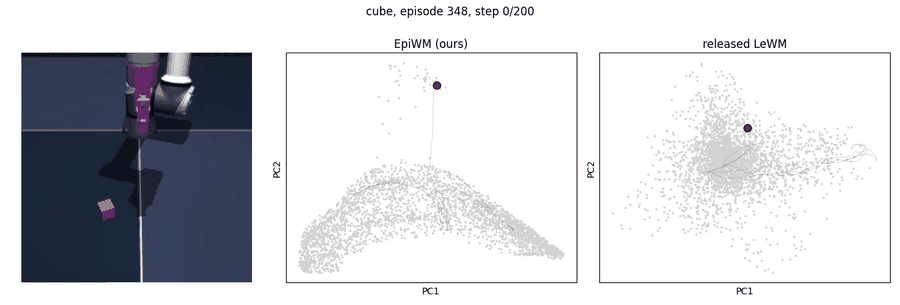

# EpiWM: epiplexity as the anti-collapse term of LeWorldModel

[Blog post](https://the-puzzler.github.io/blog/epiwm/) · [Checkpoints](https://huggingface.co/basilboy/epiwm)

[LeWorldModel](https://github.com/lucas-maes/le-wm) (LeWM) learns a latent world model end-to-end from pixels and plans
in its latent space with CEM. To stop the embedding collapsing it adds **SIGReg**, which pushes the embeddings
towards an isotropic Gaussian. Here SIGReg is replaced by the **epiplexity score** from EpiJEPA (`../epiplexity.py`),
which rewards embeddings that are linearly predictable from a frozen random CNN reservoir of the same frames.
EpiWM uses LeWM's released data and CEM planner. The projector change and training budgets are described below.

```
SIGReg (LeWM):  loss = ||pred(z_t, a_t) - z_t+1||^2 + 0.09 * SIGReg(z)
EpiWM:          loss = ||pred(z_t, a_t) - z_t+1||^2 - lambda * S(z) / S0
                S  = epiplexity of the embeddings w.r.t. a frozen random CNN reservoir of the frames
                S0 = S of the untrained model (average over 4 batches)
```

EpiWM has one architectural change: a non-affine BatchNorm on the projector output
(`module.ProjectorBN`). The score grows with the embedding scale, so the scale is pinned, as in the CIFAR and
Imagenette EpiJEPA encoders. SIGReg does not need this because its N(0, I) target already fixes the scale.

## Results

Planning success rate (%) with LeWM's CEM planner. There are three evaluation sets (see *Evaluation* below), and we
report the mean over seeds. The rows are:

- **EpiWM:** 3 seeds.
- **SIGReg retrain:** LeWM's own recipe (SIGReg, weight 0.09) trained by us with the same loop, data and budget as
  EpiWM, 2 seeds.
- **Released LeWM:** the official checkpoint (about 200k steps), evaluated by us with LeWM's unmodified released
  evaluation.

| Environment | Model (steps, seeds) | paper-50 | n=200 | n=500 |
|---|---|---|---|---|
| TwoRoom | **EpiWM** λ=0.03 (30k, 3) | **100** | **100** | **99.9** |
| | SIGReg retrain (30k, 2) | 89 | 85.5 | 87.9 |
| | released LeWM | 86 | 85.0 | 82.8 |
| Push-T | **EpiWM** λ=0.1 (60k, 3) | 92 | **89.3** | 88.5 |
| | SIGReg retrain (60k, 2) | 89 | 87.3 | **88.6** |
| | released LeWM | **96** | 83.5 | 84.6 |
| Cube | **EpiWM** λ=0.03 (60k, 3) | 70.7 | **73.2** | **71.5** |
| | SIGReg retrain (60k, 2) | **73** | 64.0 | 65.5 |
| | released LeWM | 68 | 63.0 | 66.0 |
| Reacher | **EpiWM** λ=0.3 (200k, 3) | **72.7** | **72.0** | **73.5** |
| | SIGReg retrain (200k, 2) | 60 | 62.5 | 62.2 |
| | released LeWM | 52 | 62.0 | 60.8 |

On n=500, EpiWM has higher mean success than the SIGReg retrain on TwoRoom, Cube and Reacher; Push-T is
effectively tied (88.5 vs 88.6). Its mean success is higher than the released checkpoint on all four environments.

The released-LeWM numbers are our measurements and can differ from the LeWM paper's figures. This matters most for
Reacher, where the paper reports 86:

- The paper describes training and evaluating Reacher on data collected by a SAC policy.
- The released dataset and evaluation config use random-policy data. The released checkpoint's model card lists
  that dataset, but its training provenance has not been independently verified.
- LeWM's unmodified `eval.py` gives the same 52 on paper-50 as ours, with the same per-task outcomes.
- These released-data evaluations are not directly comparable to the paper's reported 86%.

All Reacher evaluations in the table use the released random-policy data and protocol, as do training runs for
EpiWM and the SIGReg retrain. On the other environments, our released-LeWM scores are TwoRoom 86, Push-T 96 and
Cube 68, compared with 87, 96 and 74 in the paper. The paper reports means across training seeds; the release is a
single checkpoint.

The paper-50 set is noisy. For example, the released Push-T checkpoint scores 96 on it but 83.5 and 84.6 on n=200
and n=500. Per-seed numbers, all checkpoints and the λ sweeps are in [`analysis/`](analysis/).

The best checkpoint per environment is on Hugging Face: [basilboy/epiwm](https://huggingface.co/basilboy/epiwm).

### What the latent looks like



This is one Cube episode, shown next to the same moment in each model's planning latent (the first two principal
components, over 3000 random frames). In EpiWM's latent the arm and block move along a smooth, structured manifold.
The released LeWM latent is a more diffuse cloud. The episode data behind this (frame-by-frame coordinates, true
state and video), the same for every environment, plus all embeddings, probes, training logs and scores, is in the
Hugging Face repo under [`analysis/`](https://huggingface.co/basilboy/epiwm/tree/main/analysis). See
[`analysis/`](analysis/) for the figures and how to use it.

## Reproducing

### Setup

The code was run with torch 2.13.0 (2.14's cuDNN was broken on our machine), torchvision 0.28, transformers 5.17,
stable-worldmodel 0.1.1, stable-pretraining 0.1.7, hydra-core 1.3.7, h5py, hdf5plugin, scikit-learn and mujoco 3.14.
See `requirements.txt`.

Download LeWM's datasets from Hugging Face (`quentinll/lewm-{tworooms,pusht,cube,reacher}`) into
`$STABLEWM_HOME/datasets`. Then run everything from this folder:

```bash
export STABLEWM_HOME=/path/to/stablewm MUJOCO_GL=egl
```

### Training

The steps below are the best training budget per environment. They matter for reproduction, because the cosine
schedule spans `max_steps`. Planning success is not monotone in training length: on Push-T both regularisers peak
around 60k steps (EpiWM at 200k reaches only 81.5), while Reacher keeps improving up to 200k.

| Environment | `data=` | λ | Steps | Our wall clock (1 GPU, shared 4 ways) |
|---|---|---|---|---|
| TwoRoom | `tworoom` | 0.03 | 30,000 | ~5 h |
| Push-T | `pusht` | 0.1 | 60,000 | ~11 h |
| Cube | `ogb` | 0.03 | 60,000 | ~12 h |
| Reacher | `dmc` | 0.3 | 200,000 | ~30–40 h |

```bash
python train.py data=tworoom model=epi loss.reg=epi loss.epi.weight=0.03 max_steps=30000  run_name=tw_epi
python train.py data=pusht   model=epi loss.reg=epi loss.epi.weight=0.1  max_steps=60000  run_name=pusht_epi
python train.py data=ogb     model=epi loss.reg=epi loss.epi.weight=0.03 max_steps=60000  run_name=cube_epi
python train.py data=dmc     model=epi loss.reg=epi loss.epi.weight=0.3  max_steps=200000 run_name=reacher_epi
# our replication of LeWM (SIGReg, weight 0.09): same command with model=sigreg loss.reg=sigreg
python train.py data=pusht   model=sigreg loss.reg=sigreg max_steps=60000 run_name=pusht_sigreg
```

Seeds 2 and 3 use `seed=2` and `seed=3`; the default seed is LeWM's 3072. We ran with `num_workers=4`. Checkpoints go
to `$STABLEWM_HOME/checkpoints/<run_name>/weights_step<N>.pt`, and logs go to `runs/<run_name>/train_log.json`.

### Evaluation

```bash
python eval.py --config-name=tworoom.yaml policy=tw_epi/weights_step30000.pt                       # paper-50
python eval.py --config-name=tworoom.yaml policy=tw_epi/weights_step30000.pt eval.num_eval=200     # n=200
python eval.py --config-name=cube.yaml policy=cube_epi/weights_step60000.pt eval.num_eval=200 +eval_chunk=0/4  # chunks 0..3
```

Here `eval.num_eval=500` with `+eval_chunk=i/10` gives n=500. Pooling the chunks reproduces the unchunked start set
exactly.

The released LeWM checkpoints (`quentinll/lewm-*`) were saved with transformers 4. Convert them once with
`python convert_hf4_ckpt.py weights.pt weights_v5.pt`, and put the result in a checkpoint folder with its
`config.json`.

### Check that this code reproduces the results

`train.py` is a cleaned-up version of the research script that produced the numbers above, with the ablations
removed. We checked it by retraining TwoRoom from scratch with it.

- It gives the same S0 (256.832) and the same step-1 losses as the original run.
- At 10k steps it tracks the original (prediction loss 0.0042 vs 0.0041; effective rank 19.3 vs 19.7).
- After 30k steps it plans at 100% on paper-50 and 99.5% on n=200, against 100 / 100 for the original seeds.
- The runs differ after the first step only through random-number order.
